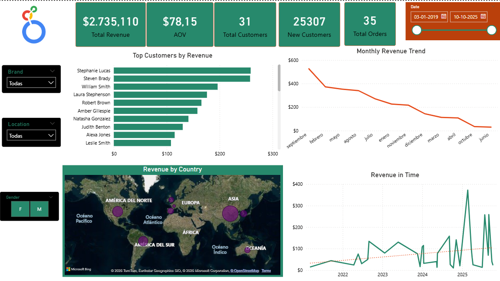
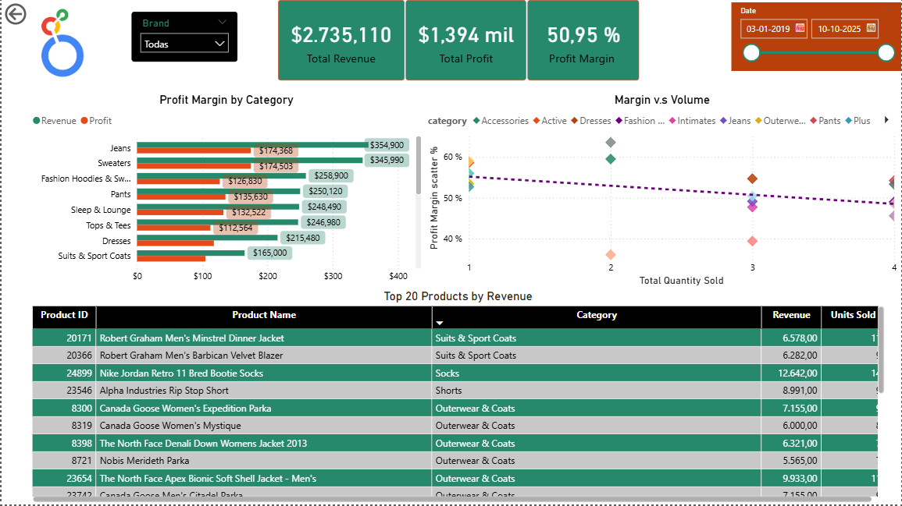
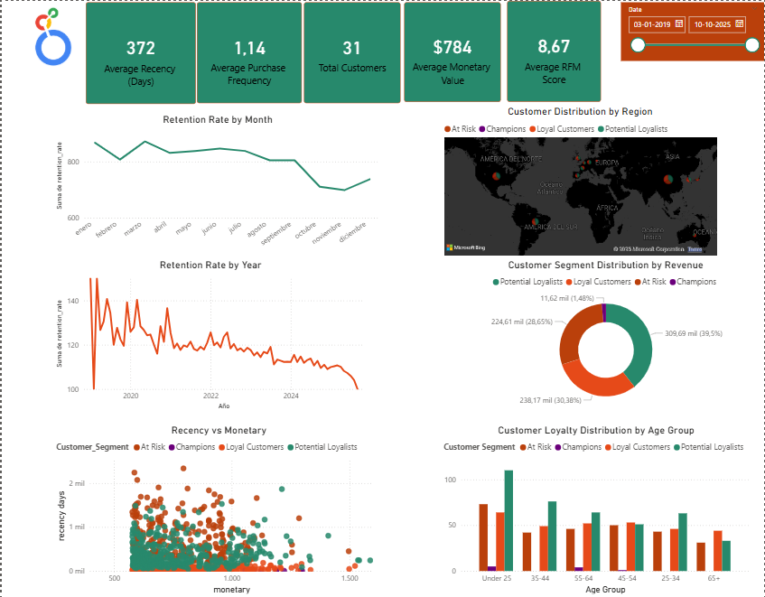
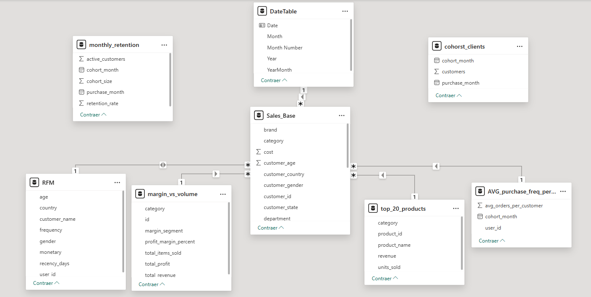

# 🛍️ Project 2 – E-commerce Analysis with BigQuery and Power BI

This project performs a complete business analytics process using **Google BigQuery** and **Microsoft Power BI** on the public dataset **thelook_ecommerce**.  
The goal is to uncover data-driven insights about **revenue trends, product profitability, and customer retention** to support strategic business decisions.

---

## 🎯 Business Objective

To identify:
- Which product categories and customers drive the highest **revenue and profit**.
- How **customer loyalty and retention** evolve over time.
- What **marketing and pricing opportunities** exist based on customer purchasing behavior.

---

## 📊 Dashboards Overview

### 🧭 1. Sales Overview Dashboard

**Key Metrics:**
- Total Revenue: \$2.73M  
- Average Order Value (AOV): \$78.15  
- 25,307 New Customers  
- Monthly Revenue Trend and Top Customers  
- Revenue by Country & Gender filters

---

### 💰 2. Product Profitability Dashboard

**Highlights:**
- Total Profit: \$1.39M  
- Profit Margin: 50.9%  
- Top 20 products by revenue and margin  
- Profit margin vs. volume correlation by category  
- Strategic insight: *Sweaters and Jeans dominate sales volume, but Suits & Coats drive higher profitability.*

---

### 👥 3. Customer Retention & RFM Dashboard

**Key Metrics:**
- Average Recency: 372 days  
- Average Frequency: 1.14  
- Average Monetary Value: \$784  
- Average RFM Score: 8.67  
- Distribution by region, segment, and age group  
- Retention rate trends (monthly and yearly)

**Segmentation Logic (RFM):**
- **Champions:** High frequency, high monetary value, recent purchases  
- **Loyal Customers:** Frequent buyers with consistent monetary value  
- **Potential Loyalists:** Newer customers with medium frequency  
- **At Risk:** Long recency and low frequency  

---

## ⚙️ Technical Process

1. **Data Exploration (BigQuery)**
   - Cleaned and joined transactional tables (`orders`, `products`, `customers`, `inventory_items`)
   - Created derived tables for sales, margin, and customer cohorts.

2. **ETL Logic**
   - Aggregated by `order_id`, `product_id`, and `customer_id`
   - Created `sales_base` and `rfm_table` views for Power BI connection.

3. **Power BI Modeling**
   - Star schema with fact tables (`Sales`, `RFM`) and dimension tables (`Products`, `Customers`, `Calendar`)
   - Relationships defined with single-direction filters to ensure measure accuracy.
   -

4. **DAX Measures**
   ```DAX
   Total Revenue = SUM('Sales Base'[sale_price])
   Total Profit = [Total Revenue] - SUM('Sales Base'[cost])
   Profit Margin % = DIVIDE([Total Profit], [Total Revenue], 0)

   Average Recency (Days) = AVERAGE(RFM[Recency_days])
   Average Monetary Value = AVERAGE(RFM[Monetary])
   Average Purchase Frequency = AVERAGE(RFM[Frequency])
   RFM Score = [Recency_Score] + [Frequency_Score] + [Monetary_Score]
   ```

## 🧱 Tools & Technologies

| Tool | Purpose |
| :--- | :--- |
| **Google BigQuery** | Data extraction and transformation using SQL. |
| **Power BI** | Data modeling, visualization, and storytelling. |
| **DAX** | Custom **KPIs** and **RFM** segmentation. |
| **GitHub** | Version control and documentation. |

---

## 🧠 Analytical Insights (Summary)

* Over **50% profit margin** indicates operational efficiency.
* **Top 10 customers** account for a significant share of revenue concentration.
* Customer base shows **declining retention post-2023**, suggesting the need for re-engagement campaigns.
* High-value segments (**Champions & Loyal Customers**) primarily located in **North America and Europe**.
* 📄 A detailed business insights **PDF** is being prepared and will be added soon.

---

## 💡 Skills Demonstrated

* Advanced SQL (**CTEs**, aggregations, window functions).
* Power BI Data Modeling & **DAX**.
* **KPI** Design and Dashboard Storytelling.
* Business Analysis and Data Interpretation.
* **Git**-based Project Documentation.

---

## 🚀 Project Value

This project simulates a real-world analytics case for an **international e-commerce company**.

It delivers not only dashboards but **strategic, data-backed narratives** that guide decision-making in marketing, pricing, and customer management.

## 📁 Repository Structure
```pgsql
├─ Image/
│   ├─ customer_insights.png
│   ├─ key_metrics.png
│   ├─ products_profitability.png
├─ docs/
│   └─ exploration_notes.md
├─ powerbi/
│   ├─ DAX_Measures.md
│   └─ Data_Model_Overview.md
├─ sql/
│   ├─ 01_business_overview_metrics.sql
│   ├─ 02_sales_and_margin_drivers.sql
│   ├─ 03_customer_dynamics_and_cohorts.sql
│   ├─ 04_sales_base.sql
│   └─ Exploration.sql
├─ README.md
```
