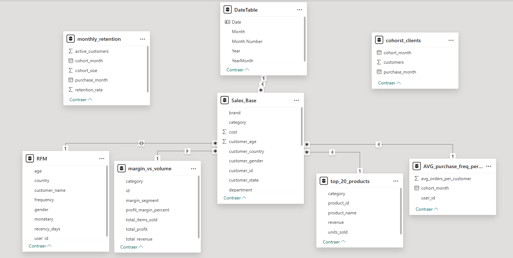

# 🧩 Data Model Overview – Sales & Customer Analytics Dashboard

The data model was designed with a **semi-structured star schema** approach, where the **Sales_Base** table acts as the **central fact table**, connecting various analytical views derived from BigQuery.
This design balances the simplicity of navigation in Power BI with the flexibility required for complex DAX calculations.



---

## ⚙️ General Model Structure

**Central Table (Fact Table):**
* **`Sales_Base`** contains the detail of every transaction: product, customer, date, price, and units sold.
* All DAX measures that feed the profitability, sales, and customer behavior dashboards are derived from this table.

**Dimension and Derived Tables:**
* **`DateTable`** → Temporal dimension used for month, year, and trend analyses.
* **`RFM`** → Customer classification based on Recency, Frequency, and Monetary value.
* **`margin_vs_volume`** → Aggregated profitability metrics by category.
* **`top_20_products`** → Subset with the top 20 most profitable or highest volume products.
* **`AVG_purchase_freq_per_customer`** → Average purchase frequency per customer and cohort.
* **`monthly_retention`** → Analytical table that measures the monthly retention rate.
* **`cohort_clients`** → Customer cohorts grouped by acquisition month.

---

## 🔗 Table Relationships

| Relationship | Type | Description | Filter Direction |
|-----------|------|--------------|--------------------|
| **DateTable[Date] → Sales_Base[order_date]** | 1 → * | Standard temporal relationship for trend and inter-month comparison calculations. | ↔ Bidirectional |
| **RFM[user_id] → Sales_Base[user_id]** | 1 → * | Each customer in the RFM table can have multiple orders in Sales_Base. | From RFM to Sales_Base |
| **AVG_purchase_freq_per_customer[user_id] → Sales_Base[user_id]** | 1 → * | Allows for calculating average purchase frequency per customer in dynamic visuals. | From AVG_purchase_freq to Sales_Base |
| **Sales_Base[product_id] ↔ margin_vs_volume[product_id]** | * ↔ * | Many-to-many relationship due to the aggregated nature of the margin_vs_volume table, which groups metrics by product and category. | Filter controlled using DAX measures. |
| **Sales_Base[product_id] ↔ top_20_products[product_id]** | * ↔ * | Allows for comparing global behavior with the top-selling or most profitable products. | Filter controlled using DAX measures. |

> 💡 *Many-to-many relationships are intentionally kept inactive or with unidirectional filters to avoid ambiguity in calculations.*

---

## 🧠 Analytical Tables Without Physical Relationship

The **`monthly_retention`** and **`cohort_clients`** tables are not directly related in the model, as they represent derived (non-hierarchical) analyses.
They are integrated into the model through **virtual relationships in DAX** using functions like:

```DAX
CALCULATE(
    [Retained Customers],
    TREATAS(
        VALUES('cohort_clients'[user_id]),
        'Sales_Base'[user_id]
    )
)
```
This keeps the model clean and scalable, preventing circular dependencies or cardinality conflicts.

---

## 🧭 Benefits of the Design

It allows for analyzing the business from three main perspectives:
* **Business Overview:** General view of commercial performance (revenue, orders, customers, average ticket).
* **Sales & Profitability:** Profitability by category, margins, and top products.
* **Customer & Market Insights:** Purchase behavior, retention, and cohorts.

The design also:
* Optimizes Power BI performance by minimizing complex direct relationships.
* Facilitates model understanding for analysts, recruiters, or technical teams.

---

## 📘 Conclusion

This model combines a modular and analytical architecture, based on e-commerce transactional data, to obtain a comprehensive view of the business.

The strategic use of many-to-many and virtual relationships in DAX reflects an advanced approach to data modeling and performance optimization for dynamic visualizations in Power BI.


